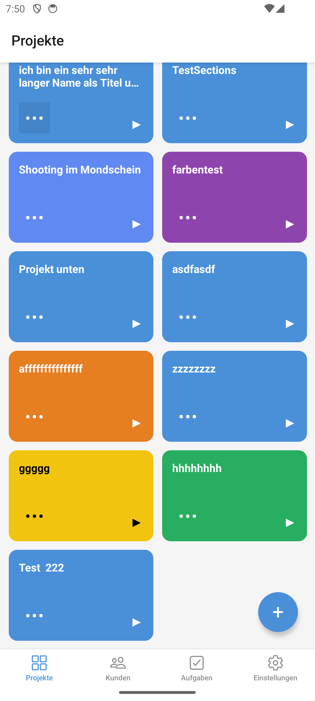
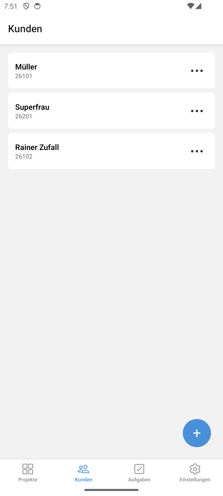
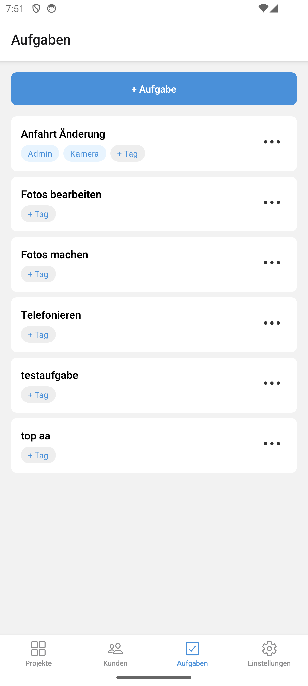

# Projekt-Tracker

Zeiterfassung für Selbstständige, gebaut für einen konkreten Anwendungsfall: Fotoaufträge nach Kunde und Auftragsart erfassen, pro Aufgabe abrechnen und am Monatsende als Excel exportieren. Ersetzt einen Workflow aus Stoppuhr, Notizzettel und manuell gepflegter InDesign-Rechnung.

Der Kern ist **Offline-First**: die App arbeitet vollständig gegen eine lokale SQLite-Datenbank. Der Server ist ein Synchronisationsziel, keine Voraussetzung — am Set gibt es kein Netz, und ein Timer, der auf eine API wartet, ist nutzlos.

> **Status:** Funktionsfähig auf Android, aktiv in Entwicklung. Backend ist deploybar, aber noch nicht deployt. iOS ist gebaut, aber ungetestet. Details unter [Stand](#stand).

## Screenshots

| Projekte                                                        | Kunden                                         | Aufgaben                                           |
| --------------------------------------------------------------- | ---------------------------------------------- | -------------------------------------------------- |
|  |  |  |

## Wie es sich bedient

Ein **Tap** auf eine Projekt-Kachel startet den Timer, ein zweiter stoppt ihn. Beim Stoppen fragt ein Modal nach der Aufgabe — erst dann entsteht ein Zeiteintrag. Die Kacheln lassen sich per **Long-Press ziehen** und frei anordnen; die Reihenfolge wird gespeichert und synchronisiert.

Jeder Kunde bekommt automatisch eine fünfstellige Kundennummer nach dem Muster `JJ` + `Auftragsart-Ziffer` + `laufende Nummer` — `26101` ist also der erste Hochzeits-Kunde des Jahres 2026.

## Architektur

```
projekt-tracker/
├── project-tracker/     Expo-App (expo-router, SQLite via Drizzle)
├── packages/
│   ├── schema/          geteiltes Drizzle-Schema: pg.ts + sqlite.ts + Migrationen
│   └── server/          Hono-Backend (Sync, Excel-Export)
└── docs/screenshots/
```

`packages/schema` ist der Angelpunkt: dieselben Tabellen werden einmal für PostgreSQL und einmal für SQLite definiert. Beide Seiten teilen sich die Typen, ein Feld kann also nicht auf einer Seite existieren und auf der anderen fehlen, ohne dass der Typecheck es merkt.

### Synchronisation

Push-Pull mit **Last-Write-Wins pro Zeile** über `updated_at`. Kein CRDT — die App hat einen Nutzer, konkurrierende Bearbeitungen derselben Zeile auf zwei Geräten sind faktisch ausgeschlossen, und CRDT-Infrastruktur wäre wochenlange Arbeit für null Mehrwert. Bei einem Konflikt gewinnt die neuere Zeile:

```sql
ON CONFLICT (id) DO UPDATE SET ... WHERE excluded.updated_at > projects.updated_at
```

Diese Entscheidung strahlt bis ins UI aus. Weil LWW die **ganze Zeile** ersetzt, darf eine häufige Operation nicht viele Zeilen anfassen — sonst überschreibt sie fremde Änderungen, die sie nie gesehen hat. Deshalb trägt die Sortierung der Projekt-Kacheln dünn besetzte Ganzzahlen (Schritt 1000) statt fortlaufender Ränge: beim Verschieben bekommt die gezogene Kachel den Mittelwert zwischen ihren neuen Nachbarn, und es wird **genau eine Zeile** geschrieben. Nur wenn zwischen zwei Nachbarn keine ganze Zahl mehr frei ist, wird einmal neu verteilt.

## Getroffene Entscheidungen

Die ausführlichen ADRs liegen außerhalb des Repos. Die wichtigsten in Kurzform:

**Geld ist ein Integer in Cent.** Nie Float. Stundensätze, Festpreise und Beträge sind `*_cents`-Spalten; die Umrechnung passiert erst in der Anzeige.

**Der Stundensatz wird pro Zeiteintrag eingefroren.** Ändert sich der Projektsatz, bleiben bereits erfasste Zeiten bei ihrem Satz — die Rechnung soll abbilden, was zum Zeitpunkt der Arbeit galt. Der Snapshot ist bewusst nachträglich überschreibbar: beim Ändern des Satzes fragt ein Dialog, ob rückwirkend angewendet werden soll.

**Das Schema ist von Tag 1 mandantenfähig.** Jede fachliche Tabelle hat `user_id` plus Index, jede Query filtert darauf, obwohl es aktuell genau einen Nutzer gibt. Nachträglich einzuziehen wäre eine Datenmigration; jetzt sind es ein paar Spalten.

**Kein direktes `db.select()` außerhalb der Repository-Schicht.** Das ist die Stelle, an der die `user_id`-Disziplin durchgesetzt wird — verstreute Queries in Screens hätten sie unprüfbar gemacht.

**Nur ein Timer gleichzeitig.** Tippt man ein zweites Projekt an, während einer läuft, fragt die App nach und stoppt den alten. Ein Unique-Index auf `timers(user_id)` erzwingt das auch in der Datenbank.

## Entwickeln

Voraussetzungen: Node 22, pnpm 10, ein Android-Emulator oder iOS-Simulator.

```bash
pnpm install            # baut über postinstall auch packages/schema
cd project-tracker
npx expo start --android
```

Aus dem Repo-Root über alle Packages:

```bash
pnpm test               # 134 Tests (104 Mobile, 30 Server)
pnpm lint
pnpm typecheck
```

Das Backend braucht eine PostgreSQL-Instanz und `DATABASE_URL`; ohne die Variable überspringen sich die Integrationstests selbst.

> Nach Änderungen an `packages/schema` muss `pnpm --filter @projekt-tracker/schema build` laufen, sonst meldet `tsc` Fehler über Spalten, die es längst gibt.

## Tests

134 Tests, Schwerpunkt auf dem, was tatsächlich brechen kann:

- **Repositories** laufen gegen echtes SQLite im Speicher (`better-sqlite3`), nicht gegen gemockte Query-Ergebnisse. Ein Test, der eine Drizzle-Antwort fälscht, prüft die Fälschung — nicht das SQL.
- **Reine Logik** (Kundennummern-Vergabe, Geldrundung, Sortierschlüssel, Kontrastberechnung für die Kachelfarben) ist bewusst aus der Datenbankschicht herausgezogen und einzeln getestet.
- **Migrationen** haben eigene Tests, inklusive des Upgrade-Pfads: alte Version anlegen, Zeilen einfügen, migrieren, prüfen dass die vorherige Sortierung erhalten bleibt — und dass ein zweiter Lauf nichts kaputt macht.
- **Sync** wird über beide Richtungen getestet, inklusive des Falls, dass eine ältere Server-Zeile eine neuere lokale **nicht** überschreiben darf.

Was **nicht** getestet ist: die React-Komponenten. Es gibt keine Component-Test-Infrastruktur, UI-Verhalten wird manuell auf dem Gerät verifiziert. Das ist eine bewusste Lücke, keine vergessene.

## Stand

| Bereich                                              | Stand                     |
| ---------------------------------------------------- | ------------------------- |
| Lokale Erfassung (Projekte, Kunden, Aufgaben, Timer) | fertig                    |
| Backend + Sync                                       | fertig, **nicht deployt** |
| Excel-Export                                         | fertig                    |
| App-PIN + Biometrie                                  | fertig                    |
| Android                                              | getestet                  |
| iOS                                                  | gebaut, **ungetestet**    |
| Rechnungserstellung                                  | geplant                   |

## Tech-Stack

Expo SDK 54 · React Native 0.81 (New Architecture, React Compiler) · TypeScript strict · expo-router · Drizzle ORM · expo-sqlite · Reanimated 4 · Hono · PostgreSQL 16 · Zod · Vitest/Jest · pnpm-Workspaces
